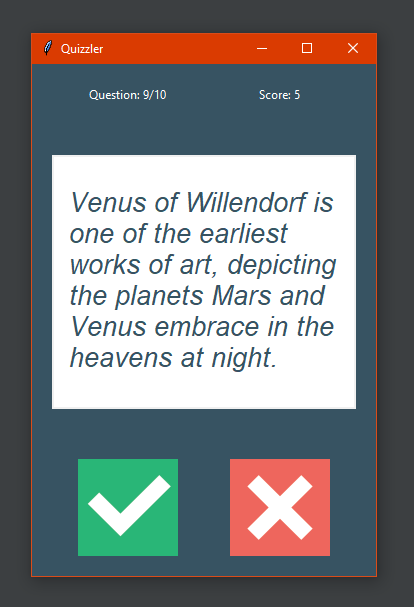
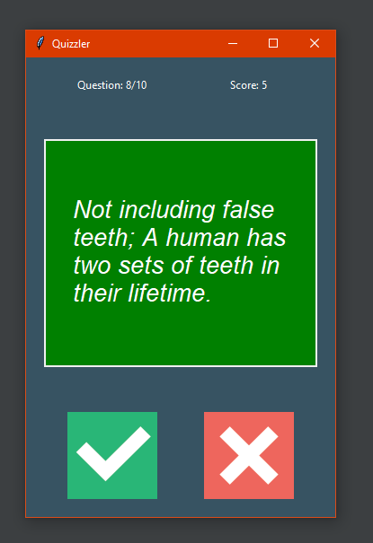
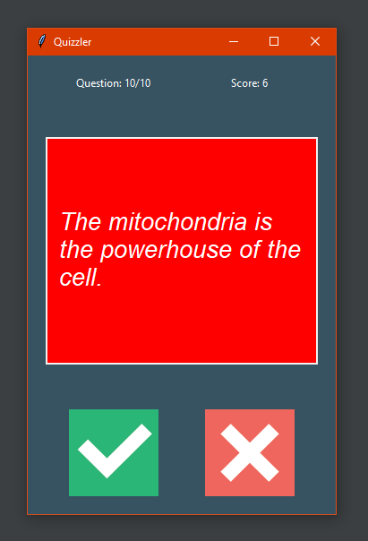
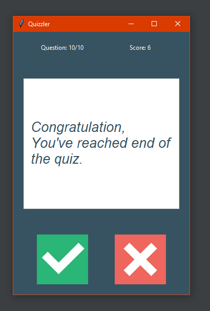

# 📚 ❓ Quizzler ❓ 📚

---
### Description:
* ❓ - **10 questions** 
* 🎲 - **Random Difficulty and Category**
* ✅**True / ❌ False** based questions

---

### Technologies:
* **tkinter** - for Graphical User Interface (GUI)
* **requests** with **[OpentriviaDB](https://opentdb.com/) API** - to get new quastions  
* **html** to unescape given question 

---
### Description
* Press  ✅ **green check** ✅  if you think sentence is true
* Press ❌ **red cross** ❌ if you think sentence is not true
* There is always **10 questions**, all random selected with random difficulty and category
---

### GUI   

#### Select ✅ or ❌: 

#### When is the answer correct

#### When is the answer wrong

#### When you finish the Quizzler

